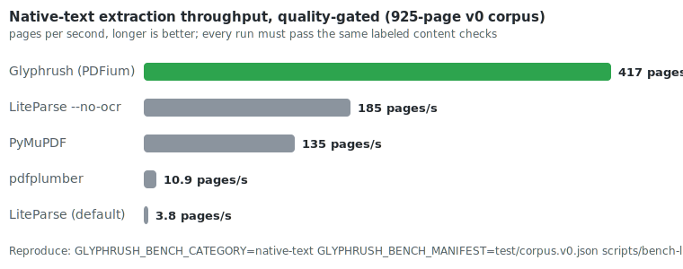

# Glyphrush

[](https://github.com/agrimsingh/glyphrush/actions/workflows/ci.yml)
[](LICENSE)

**An extremely fast PDF parser that never lies about what it extracted.**

Glyphrush turns PDFs into structured text, layout, and tables at 400+ pages per second, and flags every page it cannot fully handle (`requires_ocr`, `layout_uncertain`, `table_uncertain`) instead of returning silently broken output. Every performance claim in this README is reproduced by one script and enforced by a gate that fails when the claim stops being true.



**67× faster** than LiteParse's default pipeline and **1.65× faster** than its no-OCR fast path on a 925-page mixed corpus, with both parsers passing the same labeled quality checks on the same run. Not a speed-only number: runs that fail content checks don't count. Full methodology, caveats, and reproduction in [docs/benchmarking.md](docs/benchmarking.md).

## Highlights

- **Honest by construction.** A scanned page comes back flagged for OCR, never as fake-clean empty text. Layout and table uncertainty are first-class flags in the output, and `debug-page` explains every routing decision.
- **Structured output, not a text dump.** Deterministic JSON artifacts with positioned spans, layout blocks (paragraphs, headings, headers/footers, figures), and tables as `rows[].cells[]` with blank cells preserved. Markdown and plain-text are derived views of the same artifact.
- **Reading order that survives real documents.** Two-column academic papers read title → abstract → left column → right column. Centered page numbers, banners, and footers become bands instead of corrupting column splits.
- **Tables from three kinds of evidence.** Delimited/whitespace text grids, aligned positioned spans, and vector ruling lines (a filled government voucher's line items come out as structured cells with quantities, prices, and amounts in the right columns).
- **OCR without the tax.** No bundled engine, no hidden network calls, nothing on the hot path. Sidecar/command/HTTP adapters run only for the pages that need them.
- **One native core, four surfaces.** CLI, Python, Node, and WASM bindings all emit the identical artifact, enforced by a deep-equal parity test.

## Quickstart

```sh
git clone https://github.com/agrimsingh/glyphrush && cd glyphrush
cargo build --release -p glyphrush-cli --features pdfium   # fast path; PDFium runtime auto-downloads on first use

./target/release/glyphrush parse paper.pdf --format markdown
./target/release/glyphrush parse paper.pdf --format json    # full structured artifact
./target/release/glyphrush inspect report.pdf --pages       # per-page triage: routes, flags, timings
```

A dependency-light pure-Rust build (no PDFium) is `cargo build --release -p glyphrush-cli`.

### Bindings

```python
import glyphrush                       # bindings/python: thin wrapper over the native binary
artifact = glyphrush.parse("your.pdf", binary="target/release/glyphrush")
```

```js
import { parseMarkdown } from "./bindings/node/src/index.mjs";
const md = parseMarkdown("your.pdf", { binary: "target/release/glyphrush" });
```

```js
import { parse_pdf_bytes } from "./bindings/wasm/pkg/glyphrush_wasm.js";   // bash bindings/wasm/build.sh
const artifact = JSON.parse(parse_pdf_bytes(pdfBytes, false));
```

Set `GLYPHRUSH_BIN=/path/to/glyphrush` to skip the `binary` argument. Package-manager installs (crates.io, PyPI, npm) are on the roadmap; today Glyphrush builds from source in one command.

## Why it's fast

Most PDF tooling pays for the worst case on every page: rendering, OCR, per-character geometry. Glyphrush inverts that.

1. **Classify cheap, escalate honestly.** Per-page signals (image coverage, encoding health, ruling density, text duplication) route each page to the lightest path that can handle it. The 67× over OCR-enabled LiteParse is the cost of OCR that digital PDFs never needed; Glyphrush proves it per page instead of assuming.
2. **A hot path that does almost nothing.** Native text extraction with no rendering and no per-character metadata. Geometry (`--span-geometry`) is opt-in and bounded.
3. **Heavier work only where evidence demands it.** Column splitting, table recovery, and OCR handoff run on routed pages, and each records *why* it ran in the artifact.

Speed claims are kept honest by design: the benchmark embeds quality scoring of the exact artifacts it timed, labels are verified against every baseline's real output (so no parser fails on formatting quirks), and `feature-parity --require-speed-evidence` turns the claim into a CI-checkable verdict. The committed corpus spans academic papers, government reports, forms, budget tables, an invoice voucher, scans, and broken-encoding fixtures.

## What the output looks like

```sh
glyphrush parse invoice.pdf --format json --span-geometry
```

```jsonc
{
  "pages": [{
    "route": "needs_fallback",                  // why: table_line_density
    "quality": { "flags": ["table_uncertain"], "layout_confidence": 40 },
    "layout_blocks": [{
      "kind": "table",
      "table": { "rows": [ { "cells": [
        { "column_index": 1, "text": "2026-01-05" },
        { "column_index": 3, "text": "4" },
        { "column_index": 4, "text": "385.00" },
        { "column_index": 6, "text": "1,540.00" }   // blank cells preserved as empty
      ] } ] }
    }],
    "native_spans": [ /* positioned text with bounding boxes */ ]
  }]
}
```

Same input, same options, same artifact: page order, span order, flags, and artifact IDs are deterministic, which is what makes the output cacheable (`--cache-dir`) and diffable in CI.

## Commands

| Command | Purpose |
|---|---|
| `parse <pdf> --format json\|text\|markdown` | Extract one document |
| `inspect <pdf-or-dir> [--pages]` | Fast triage: routes, flags, timings |
| `debug-page <pdf> <n>` | Explain one page's routing and layout |
| `eval <manifest>` | Run labeled quality gates over a corpus |
| `bench <pdf-or-dir> [--baseline-preset glyphrush-v0]` | Speed + quality report vs external parsers |
| `manifest <pdf-or-dir>` | Bootstrap an eval manifest from current output |
| `feature-parity [--bench-report <json>]` | LiteParse capability matrix + claim readiness |
| `backend-check` / `baseline-check` / `ocr-check` | Preflights for backends, baselines, OCR adapters |

Every command emits machine-readable JSON. Flag-by-flag documentation: [docs/cli-reference.md](docs/cli-reference.md).

## Status

v0. The feature-parity matrix reports **11 of 13 LiteParse capabilities implemented, 0 partial**, with two rejected by recorded design decisions (MuPDF backend on AGPL grounds; bundled OCR by hot-path policy). Known conservative areas: two-level table header groups, merged cells, and cross-page table stitching stay flagged `table_uncertain` rather than guessed. History and roadmap: [docs/remaining-work.md](docs/remaining-work.md).

| Path | What it is |
|---|---|
| `crates/glyphrush-core` | Artifact model, classifier, layout, table recovery |
| `crates/glyphrush-lopdf` | Dependency-light extraction backend |
| `crates/glyphrush-cli` | The `glyphrush` binary; PDFium backend behind `--features pdfium` |
| `bindings/{python,node,wasm}` | Thin wrappers over the native core |
| `test/v0/` + `test/corpus.v0*.json` | Committed benchmark corpus and labeled quality gates |

## Contributing

```sh
cargo test --workspace                              # no local PDFs needed
GLYPHRUSH_VERIFY_PDFIUM=1 bash scripts/verify.sh    # the full CI gate
```

See [CONTRIBUTING.md](CONTRIBUTING.md). The short version: quality gates are the contract, and speed claims need quality evidence from the same run.

## License

[MIT](LICENSE)
